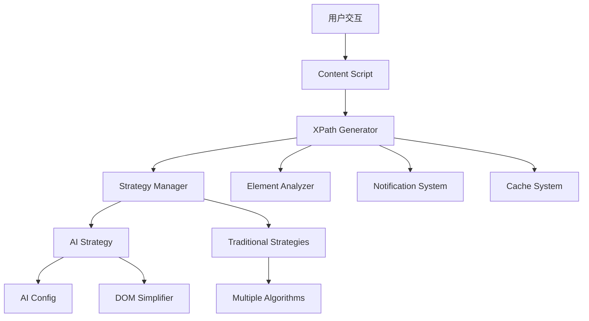

# XPath获取器 - 智能XPath生成工具

<div align="center">


一个功能强大的Chrome浏览器扩展，结合传统算法与AI技术，智能生成网页元素的精简相对XPath路径，并自动复制到剪贴板。

[功能特性](#-功能特性) • [安装方法](#-安装方法) • [使用指南](#-使用指南) • [AI配置](#-ai配置) • [技术架构](#-技术架构)

</div>

## 🙏 项目说明

> **注意**：本项目中的每一个字符都由 Claude-4-Sonnet 生成，作者对JavaScript并不熟悉。

## ✨ 功能特性

### 🤖 AI增强模式
- **智能分析** - 使用大语言模型深度理解DOM结构
- **上下文感知** - AI能理解元素在页面中的语义位置
- **自动优化** - 智能选择最佳定位策略
- **回退机制** - AI失败时自动切换到传统算法

### 🎯 传统模式
- **多策略生成** - 8种不同的XPath生成策略
- **智能优先级** - 基于元素特征自动选择最优策略
- **框架适配** - 完美支持React、Vue、Angular等现代框架
- **复杂结构** - 处理Shadow DOM、SVG、iframe等特殊元素

### 🚀 用户体验
- **一键操作** - 右键即可生成并复制XPath
- **双模式选择** - 传统模式和AI模式可选
- **实时反馈** - 智能通知系统提供详细状态信息
- **缓存优化** - 避免重复计算，提升响应速度
- **错误恢复** - 完善的错误处理和降级策略

## 🛠️ 安装方法

### 开发者安装（推荐）

1. **克隆项目**
   ```bash
   git clone https://github.com/your-username/xpath-extractor.git
   cd xpath-extractor
   ```

2. **安装扩展**
   - 打开Chrome浏览器
   - 访问 `chrome://extensions/`
   - 开启「开发者模式」
   - 点击「加载已解压的扩展程序」
   - 选择项目根目录
   - 扩展安装完成！

3. **验证安装**
   - 在任意网页右键，应该能看到「复制相对XPath」和「AI辅助生成XPath」选项

## 🚀 使用指南

### 基础使用

1. **传统模式**
   - 在网页上右键点击目标元素
   - 选择「复制相对XPath」
   - XPath自动生成并复制到剪贴板

2. **AI增强模式**
   - 在网页上右键点击目标元素
   - 选择「AI辅助生成XPath」
   - AI分析元素并生成最优XPath

### 使用技巧

- **复杂元素**：对于动态生成的复杂元素，推荐使用AI模式
- **性能考虑**：对于简单元素，传统模式响应更快
- **批量操作**：缓存机制会加速重复元素的处理
- **错误处理**：遇到问题时查看控制台日志获取详细信息

## 🤖 AI配置

### 首次设置

1. **打开设置页面**
   - 点击扩展图标 → 选项
   - 或访问 `chrome://extensions/` → XPath获取器 → 详情 → 扩展程序选项

2. **配置AI参数**
   ```
   API Key:     [您的OpenAI API密钥]
   Base URL:    https://api.openai.com/v1
   Model:       gpt-4o (推荐) / gpt-3.5-turbo
   Temperature: 0.05 (推荐保持低值以确保一致性)
   ```

3. **测试连接**
   - 点击「测试连接」按钮验证配置
   - 确保API配置正确且有足够额度


## 🏗️ 技术架构

### 核心组件



### 核心类说明

| 类名 | 职责 | 位置 |
|------|------|------|
| `XPathGenerator` | 主控制器，协调整个生成流程 | `src/core/xpath-generator.js` |
| `StrategyManager` | 策略管理，选择最佳生成算法 | `src/core/strategy-manager.js` |
| `ElementAnalyzer` | 元素分析，提取关键特征 | `src/core/element-analyzer.js` |
| `AIConfig` | AI配置管理和验证 | `src/core/ai-config.js` |
| `NotificationSystem` | 用户反馈和状态通知 | `src/core/notification-system.js` |


#### AI策略

- **上下文分析**：理解元素在页面中的业务含义
- **语义理解**：基于文本内容和周围环境判断重要性
- **模式识别**：识别常见的UI模式和设计规范
- **动态适应**：根据框架类型调整生成策略

### 项目结构

```
xpath-extractor/
├── manifest.json              # Chrome扩展配置
├── background.js              # 后台服务工作者
├── options.html               # AI配置页面
├── options.js                 # 配置页面逻辑
├── test.html                  # 测试页面
├── icons/                     # 扩展图标
│   ├── icon16.png
│   ├── icon48.png
│   └── icon128.png
└── src/
    ├── content.js             # 内容脚本入口
    ├── core/                  # 核心功能模块
    │   ├── ai-config.js       # AI配置管理
    │   ├── element-analyzer.js # 元素分析器
    │   ├── notification-system.js # 通知系统
    │   ├── strategy-manager.js    # 策略管理器
    │   └── xpath-generator.js     # XPath生成器
    ├── strategies/            # 生成策略实现
    │   ├── base-strategy.js       # 策略基类
    │   ├── ai-strategy.js         # AI策略
    │   ├── text-strategy.js       # 文本策略
    │   ├── attribute-strategy.js  # 属性策略
    │   ├── anchor-strategy.js     # 锚点策略
    │   ├── container-context-strategy.js # 容器策略
    │   ├── relative-strategy.js   # 相对位置策略
    │   ├── shadow-dom-strategy.js # Shadow DOM策略
    │   ├── svg-strategy.js        # SVG策略
    │   └── css-selector-strategy.js # CSS选择器策略
    └── utils/                 # 工具函数
        ├── utils.js           # 通用工具
        ├── dom-simplifier.js  # DOM简化器
        └── cache-debugger.js  # 缓存调试器
```


## 🔍 调试和故障排除

### 常见问题

**Q: AI模式不工作？**
A: 检查AI配置是否正确，测试API连接，确保网络畅通。

**Q: 生成的XPath不稳定？**
A: 尝试AI模式，或检查元素是否为动态生成。

**Q: 无法复制到剪贴板？**
A: 检查浏览器权限设置，确保允许扩展访问剪贴板。

### 调试工具

1. **控制台日志**：打开开发者工具查看详细日志
2. **缓存调试**：内置缓存调试器显示缓存状态
3. **网络监控**：监控AI API请求和响应
4. **策略追踪**：查看策略选择和评分过程

### 性能监控

```javascript
// 查看缓存状态
console.log(window.xpathExtension?.generator?.getCacheStats());

// 清理缓存
window.xpathExtension?.generator?.clearCache();
```

## 📝 版本历史

### v3.0 (当前版本)
- 🆕 **AI功能**：集成大语言模型智能生成XPath
- 🆕 **配置界面**：新增AI参数配置页面
- 🆕 **双模式**：传统算法和AI模式并存
- 🔧 **性能优化**：改进缓存机制和错误处理
- 🔧 **用户体验**：优化通知系统和状态反馈

### v2.0
- 重构架构，采用策略模式
- 新增多种XPath生成策略
- 改进错误处理和用户反馈
- 优化性能和缓存机制
- 增强框架兼容性

### v1.x
- ✅ 基础XPath生成功能
- ✅ 多策略支持
- ✅ 框架兼容性
- ✅ Shadow DOM支持


## 🙏 致谢

- 感谢 Claude-4-Sonnet 提供的AI支持
- 感谢开源社区的贡献和反馈
- 感谢所有使用者的支持和建议

---

<div align="center">

**如果这个工具对你有帮助，请给个⭐️支持一下！**

</div>
        
